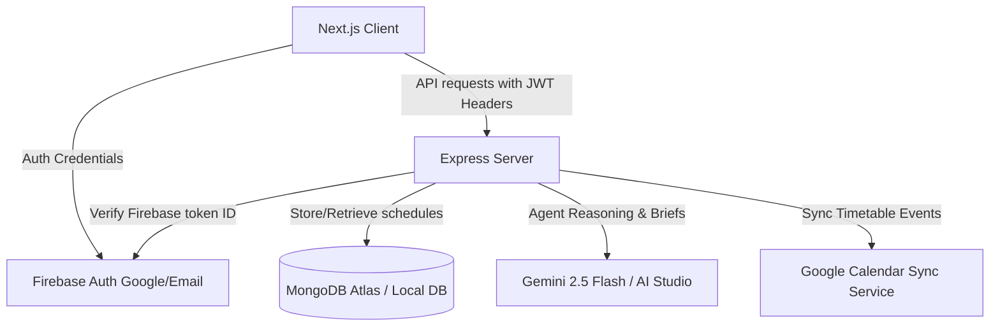

# DeadlinePilot AI ✈️⏰
### *The Last-Minute AI Executive Assistant*

DeadlinePilot AI is an advanced, production-ready AI-powered productivity companion built for the **Vibe2Ship Hackathon**. It acts like an **AI Executive Assistant** rather than a traditional static to-do app, leveraging a structured multi-agent architecture powered by **Gemini 2.5 Flash** to help users plan, prioritize, schedule, remind, and reflect on tasks before deadlines are missed.

---

## 🏗️ Architecture Design

The backend is built using a clean, enterprise-ready **Controller-Service-Repository** pattern in Node.js and Express, abstracting MongoDB queries through dedicated database wrappers and structuring AI reasoning into separate agents with schema-enforced JSON outputs.



---

## 🤖 Meet the AI Co-Pilots (Agentic Depth)
DeadlinePilot integrates multiple AI agents coordinated by a central **AI Orchestrator**:

1. **Planner Agent**: Deconstructs high-level user tasks into step-by-step chronological subtask lists, each with independent micro-hour allocations.
2. **Priority Agent**: Evaluates tasks using deadlines, estimated hours, and user habits to classify priority (`Critical`, `High`, `Medium`, `Low`) and predict the probability percentage of missing the deadline (Deadline Risk Prediction).
3. **Scheduling Agent**: Searches for available slots in the user's weekly calendar, avoiding sleep blocks, meetings, and academic lecture hours.
4. **Reminder Agent**: Formulates friendly, action-focused nudges (e.g. "You have 2 free hours now. Complete Part 2 of your homework.") based on current time gaps rather than dry alarm warnings.
5. **Reflection Agent**: Compiles completion metrics, overdue lists, and focus session logs to calculate daily/weekly Productivity Scores and outline actionable coach recommendations.
6. **AI Orchestrator**: Coordinates interactive chat sessions, natural language voice additions, and automatically triggers planning and scheduling sequences.
7. **Extension Request Assistant**: Generates professional, polite extension request emails when a task risk is classified as critical.

---

## 📂 Folder Structure

```text
DeadlinePilot/
├── client/              # Next.js 15 App Router Frontend
│   ├── src/
│   │   ├── app/         # Pages (Landing, Login, Dashboard, Analytics, Planner, Settings)
│   │   ├── components/  # AI Chat Drawer, Voice Input triggers
│   │   └── context/     # Firebase Auth Provider
│   └── .env.local       # Client environment keys
│
├── server/              # Express.js API Backend
│   ├── src/
│   │   ├── config/      # DB connection, Firebase init, Gemini init, logger
│   │   ├── controllers/ # Task, calendar, profile, analytics, AI controllers
│   │   ├── routes/      # Routers mapping requests to controllers
│   │   ├── middleware/  # Firebase verification, centralized error, rate limiting
│   │   ├── models/      # Mongoose core schemas (User, Task, SubTask, Reminder, Habits)
│   │   ├── repositories/# Database CRUD query abstractions
│   │   ├── services/    # Business logic, auth, memory context, calendar, tasks
│   │   ├── validators/  # Zod schema request validation
│   │   ├── constants/   # App priorities, roles, task status definitions
│   │   ├── utils/       # standard response templates, date/time wrappers
│   │   └── ai/          # AI agents, prompt templates, schemas, parsers, orchestrator
│   ├── docs/            # OpenAPI/Swagger definition (openapi.yaml)
│   ├── Dockerfile       # Deployment container definition
│   └── .env             # Server environment keys
│
├── docs/                # Architecture diagrams and system details
├── firebase.json        # Firebase Hosting configurations
└── README.md            # Documentation
```

---

## 🚀 Quickstart & Local Setup

### 1. Prerequisites
Ensure you have the following runtimes installed:
*   [Node.js (v20+)](https://nodejs.org/)
*   [MongoDB (Local or Atlas Account)](https://www.mongodb.com/atlas/database)

---

### 2. Backend Setup
1. Navigate to the `server/` folder:
   ```bash
   cd server
   ```
2. Install dependencies:
   ```bash
   npm install
   ```
3. Configure the environment variables:
   Create a `.env` file in the `server/` folder:
   ```env
   PORT=8000
   MONGODB_URI=mongodb://127.0.0.1:27017/deadlinepilot
   GEMINI_API_KEY=your_gemini_api_key_here
   FIREBASE_CREDENTIALS_JSON=your_firebase_service_account_json_string
   ```
   *(Note: Leave `GEMINI_API_KEY` or `FIREBASE_CREDENTIALS_JSON` empty to automatically trigger **Demo/Offline fallbacks** for rapid evaluation).*
4. Start the development server:
   ```bash
   npm run dev
   ```
   The backend will boot on `http://localhost:8000`.

---

### 3. Frontend Setup
1. Navigate to the `client/` folder:
   ```bash
   cd ../client
   ```
2. Install dependencies:
   ```bash
   npm install
   ```
3. Configure environment variables:
   Create a `.env.local` file in the `client/` folder:
   ```env
   NEXT_PUBLIC_API_URL=http://localhost:8000
   NEXT_PUBLIC_FIREBASE_API_KEY=
   NEXT_PUBLIC_FIREBASE_AUTH_DOMAIN=
   NEXT_PUBLIC_FIREBASE_PROJECT_ID=
   NEXT_PUBLIC_FIREBASE_STORAGE_BUCKET=
   NEXT_PUBLIC_FIREBASE_MESSAGING_SENDER_ID=
   NEXT_PUBLIC_FIREBASE_APP_ID=
   ```
   *(Note: If Firebase credentials are left blank, the client automatically logs in using **Mock Auth Mode**, giving full access to all panels).*
4. Start the frontend:
   ```bash
   npm run dev
   ```
   Open `http://localhost:3000` in your browser.

---

## 🚢 Production Deployment

### 1. Backend (Google Cloud Run)
We use the provided `Dockerfile` to containerize the Express backend.
1. Build and submit your Docker image to Google Artifact Registry:
   ```bash
   gcloud builds submit --tag gcr.io/your-project-id/deadlinepilot-api ./server
   ```
2. Deploy to Cloud Run:
   ```bash
   gcloud run deploy deadlinepilot-api --image gcr.io/your-project-id/deadlinepilot-api --platform managed --allow-unauthenticated --region us-central1 --set-env-vars "MONGODB_URI=your_mongodb_atlas_uri,GEMINI_API_KEY=your_gemini_key"
   ```

### 2. Frontend (Firebase Hosting)
1. Setup a static build in Next.js by adding `output: 'export'` to your `client/next.config.js` or `client/next.config.ts`.
2. Compile and export the Next.js site:
   ```bash
   cd client
   npm run build
   ```
   This generates the HTML/CSS outputs inside `client/out/`.
3. Deploy to Firebase Hosting:
   ```bash
   cd ..
   firebase deploy --only hosting
   ```
