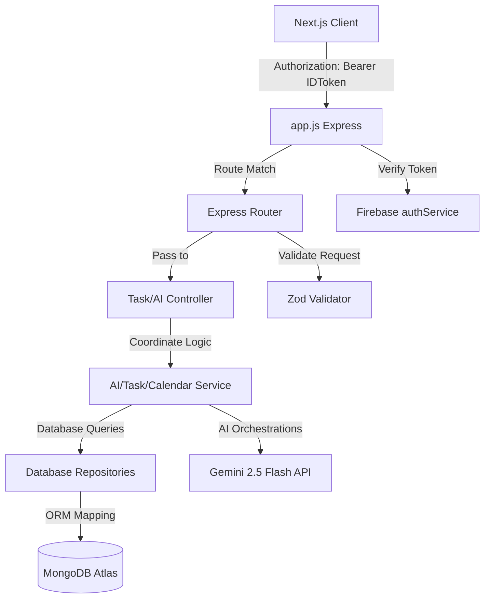

# DeadlinePilot AI System Architecture

This document details the architectural layout, data flows, and design principles implemented in the DeadlinePilot AI backend refactor.

---

## Architecture Blueprint

### 1. Controllers (`src/controllers/`)
Controllers act as entry points for request handling. They:
- Parse headers, parameters, and query fields.
- Validate payloads against **Zod schemas**.
- Call relevant business logic **Services**.
- Render consistent JSON response payloads.

### 2. Services (`src/services/`)
Services contain the central core business logic:
- Coordination of multiple database actions.
- Integration with external interfaces (Firebase Auth, Google Calendar mock, Gemini AI).
- Context memory mapping via **`memory.service.js`** to provide historical information to AI agents.

### 3. Repositories (`src/repositories/`)
Repositories act as the database abstraction layer:
- Subclass a common `BaseRepository` that encapsulates generic mongoose methods (find, create, update, delete).
- Isolate queries to specific collection models (Users, Tasks, Reminders, Analytics), avoiding scattered mongoose imports.

### 4. AI Orchestration Layer (`src/ai/`)
To achieve robust "Agentic Depth", the server organizes AI reasoning into a modular subsystem:
- **Agents (`agents/`)**: Specialized roles like Planner, Priority, Scheduler, Reminder, and Reflection agents.
- **Prompts (`prompts/`)**: Split into `.system.js` instructions and `.user.js` contexts to simplify tuning.
- **Schemas (`schema/`)**: Structured schemas passed directly into Gemini's `responseSchema` configuration, guaranteeing valid JSON responses.
- **Parser (`parser/`)**: Clean helper sanitizing output and stripping markdown code blocks.
- **Orchestrator (`orchestrator/`)**: Unifies multi-agent pipelines (e.g. Chat parsing triggering task evaluation, breakdowns, and automatic time-slot allocation).

### 5. Config, Constants, and Utilities
- **Config**: Centralized setup for Firebase, Gemini, MongoDB, env validation, and winston logger.
- **Constants**: Eliminates magic strings for priority options, task statuses, and user roles.
- **Utils**: Standardizes response formats, dates, and async express error wrappers.
